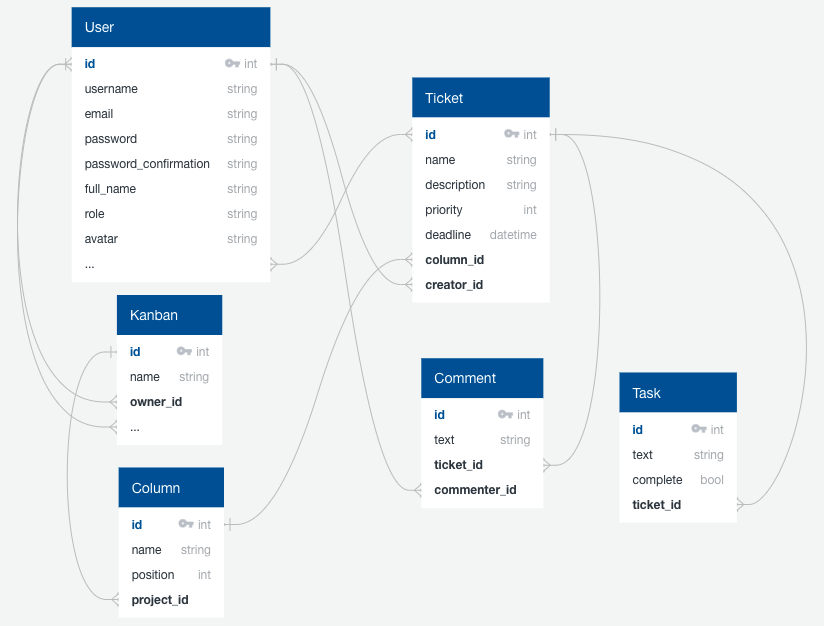
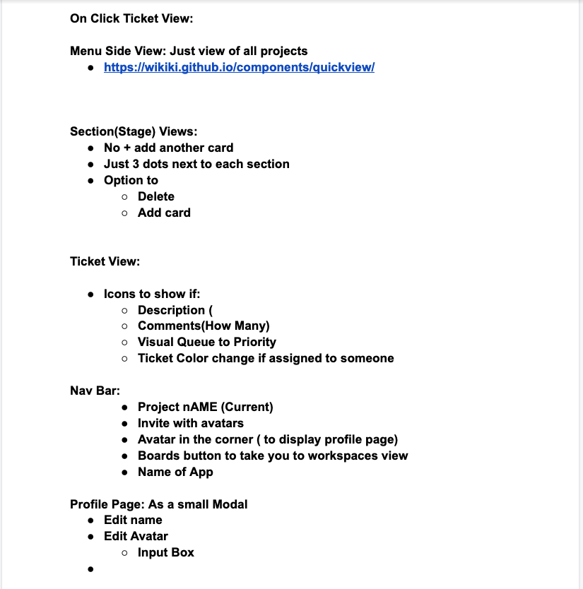
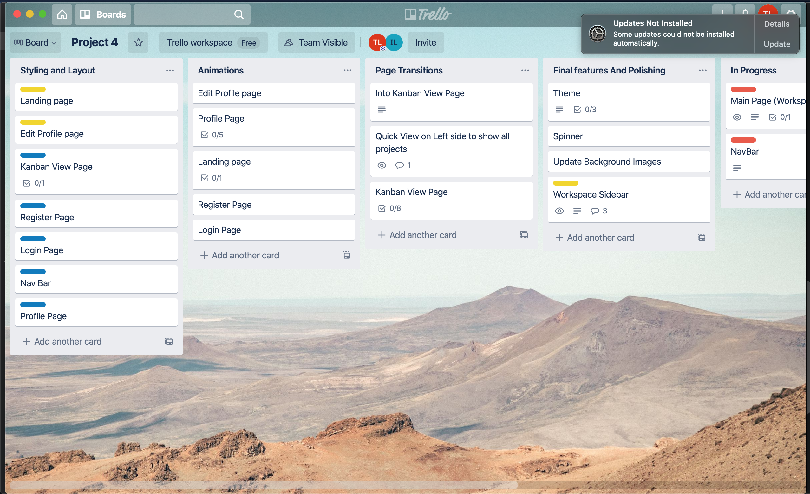
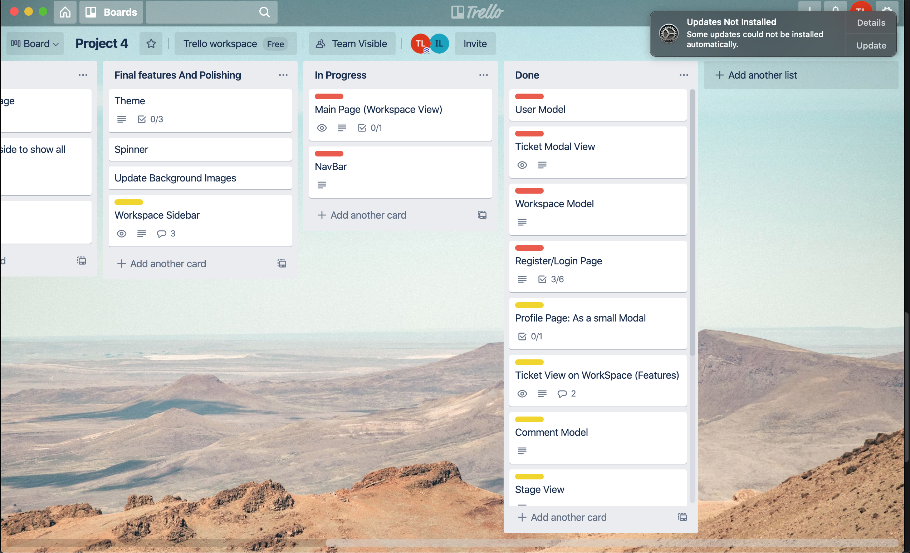
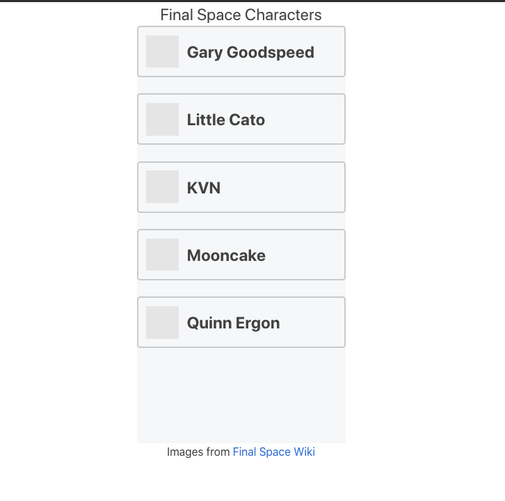
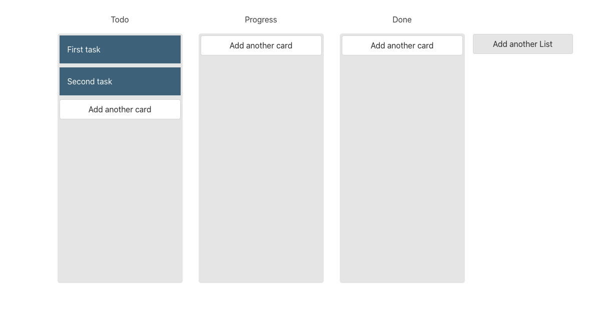
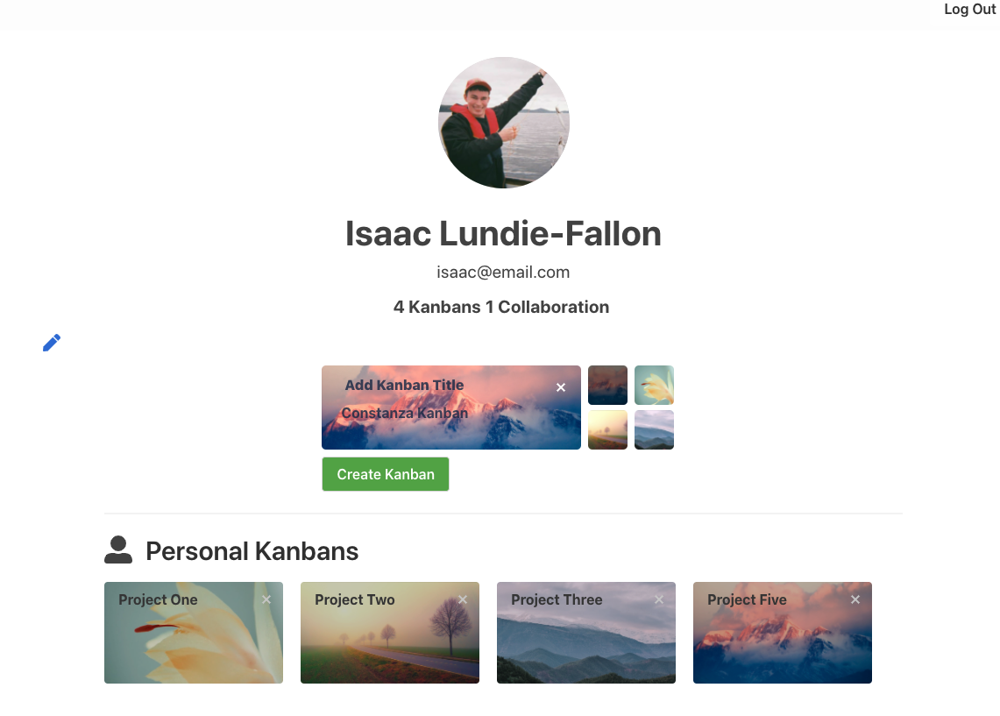
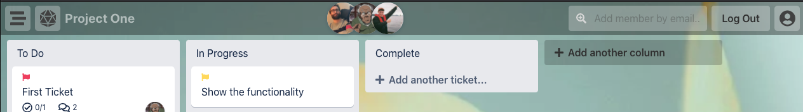

# Project 4 - Costanza
## Overview
For my fourth and final project I decided with my partner to use the drag and drop functionality on a professional level that promotes productivity and user interaction with are site if [Costanza](https://kanban-costanza.herokuapp.com/)

## Brief
* *Build a full-stack application* by making your own backend and your own front-end
* *Use a Python Django API* using Django REST Framework to serve your data from a Postgres database
* *Consume your API with a separate front-end* built with React
* *Be a complete product* which most likely means multiple relationships and CRUD functionality for at least a couple of models


## Collaborators
* Isaac Lundie-Fallon - [Github](https://github.com/isaac-lf)

## Technologies Used
* JavaScript ES6
* React.js
* HTML5 & CSS3
* SASS
* React 
* React-Router-Dom
* Framer Motion
* Bulma CSS Framework
* Axios q
*  Font Awesome 
* react-beautiful-dnd (drag and drop)
* react-datetime-picker
* react-select
* Django
* Django REST framwork
* Postgre SQL

### Dev Tools

* Todoist
* Trello
* Git 
* GitHub
* Insomnia
* VSCode
* Eslint
* Git
* GitHub & Github Pages
* Google Chrome Dev Tools
* Google Fonts
* Heroku
* Table Plus

## Demonstration of the App Flow 
* First displays the landing page which gives you the option to log in or register
* The register form gives you the option to have an avatar or use your initials of your full name as the avatar as displayed as well as a shake error animation if form is invalid 
* this then takes you to user profile page with the option to create a new board.
* Upon clicking on the create new board they are given a form to enter the kanban title as well as selecting a background of their kanban 
* once the have clicked on create new kanban they are take to the kanban with their background with the option to add their new column
* This is then where the user can create their columns and tickets and start building their planning workspace by creating priorities to tickets or assigning members to different tickets or creating a todo list with in the ticket.

## Process
We started brain storming ideas of what kind of website we wanted to do then trying to go for something unconventional to previous projects we had seen or done before. We both liked the drag and drop functionality on one of the websites we had seen so we came up with kanban project planning concept similar to the Todoist and Trello apps or kanban softwares in general.

### Plan

As soon as we came up with eh kanban idea we then started to plan out are ER diagram thinking about the functionality we were going to include.Since we only had a week we knew we had to have a clear vision on the specific features we wanted as we wouldn’t have enough time to completely clone a trello board with all its functionality .



We then further planned out our idea by going on google docs and elaborating on our concept going through the functionality on specific pages. 



In addition we created a trello board to get accustomed to the functionality on the app as well as planning are project ourselves dividing the sections of are work with the models on the back end and hooking them up to the front end with the drag and drop functionality we had dragged them to the done section upon completing and renamed the columns once we had finished the back end to plan the styling and animations for the pages.

<div style="display:flex">
  
  
</div>

### Division of Work

Since we had a project with a lot of features to implement we knew that we wouldn’t be able to work together for much of the project as we would need to cover so much. Therefore we prioritised are functionality and divided it up based on strengths.

We started out as Isaac focusing on the back end setting up the models whilst I worked on using the drag and drop functionality and how we can hook it up to the backend. We then to proceed on working on different features of the board based on priority.


### Back End (Kanban Model)

On the back end as mentioned before Isaac worked on majority of the back end whilst I had to work on the front end in order to finish on time but I did manage to add to the kanban model 

Creating a tuple of options for the backgrounds assigning them values of 123 with a default so that when the user tries to select a background it already has the default in the background.

```
from django.db import models

class Kanban(models.Model):
    BACKGROUNDS = (
        (0, 'Default Background'),
        (1, 'Background 1'),
        (2, 'Background 2'),
        (3, 'Background 3'),
        (4, 'Background 4'),
    )

    name = models.CharField(max_length=30)
    background = models.PositiveIntegerField(choices=BACKGROUNDS, default=BACKGROUNDS[0][0])
    owner = models.ForeignKey(
        'jwt_auth.User',
        related_name = 'kanbans_owner_of',
        on_delete=models.CASCADE
    )
    members = models.ManyToManyField(
        'jwt_auth.User',
        related_name='kanbans_member_of',
        blank=True
    )

```

### User Model Edit Profile

Had to create a nest user serialiser for the edit profile request to show the editable and required fields only

```
class NestedUserSerializer(serializers.ModelSerializer):

    class Meta:
        model = User
        fields = ('id', 'full_name', 'role', 'avatar')

```

```
class ProfileView(APIView):

    permission_classes = (IsAuthenticated, )

    def get(self, request):
        current_user = User.objects.get(pk=request.user.id)
        serialized_current_user = PopulatedUserSerializer(current_user)
        return Response(serialized_current_user.data, status=status.HTTP_200_OK)

    def put(self, request):
        current_user = User.objects.get(pk=request.user.id)
        edited_current_user = NestedUserSerializer(current_user, data=request.data)
        if edited_current_user.is_valid():
            edited_current_user.save()
            return Response(edited_current_user.data, status=status.HTTP_202_ACCEPTED)
        return Response(edited_current_user.errors, status=status.HTTP_422_UNPROCESSABLE_ENTITY)


```


### Front End 

#### Drag and Drop Functionality

<div style="display:flex">
  
  
</div>

I had to do a lot of research into the different ways of applying the drag and drop functionality. I had originally wanted to use [react-dnd](https://react-dnd.github.io/react-dnd/about) dependency originally based on recommendations but after researching youtube tutorials  and further reading their documentation I realised Atlassian’s [react beautiful-dnd](https://github.com/atlassian/react-beautiful-dnd) was the best option as it is  specifically built for lists (vertical, horizontal, movement between lists, nested lists and so on)”.

I then proceeded to created a separate code base in order to test the functionality of react beautiful-dnd. However I still needed to read [Jason Brown’s article](https://codedaily.io/tutorials/186/Multi-List-Drag-and-Drop-With-react-beautiful-dnd-Immer-and-useReducer) on the multi list drag and drop breaking down each function used helping mead the functionality of adding a new ticket and adding a new column.

#### Profile Page



For the profile page the main challenge was creating the background option selector and hooking each option to the back end as well as the change of images at the same time.

I assigned each background option to a css class with a number value on the end of each

```
// Backgrounds for profile and kanban view 

.kanban-background-0 {
  background: url('https://images.unsplash.com/photo-1486728297118-82a07bc48a28?ixid=MXwxMjA3fDB8MHxwaG90by1wYWdlfHx8fGVufDB8fHw%3D&ixlib=rb-1.2.1&auto=format&fit=crop&w=1401&q=80');
  background-size: cover;
  background-position: center;
}
.kanban-background-1{
  background: url('https://images.pexels.com/photos/3880526/pexels-photo-3880526.jpeg?auto=compress&cs=tinysrgb&dpr=2&h=650&w=940');
  background-size: cover;
  background-position: center;
}

.kanban-background-2 {
  background: url('https://images.pexels.com/photos/1165991/pexels-photo-1165991.jpeg?auto=compress&cs=tinysrgb&dpr=2&h=650&w=940');
  background-size: cover;
  background-position: center;
}
.kanban-background-3{
  background: url('https://images.pexels.com/photos/4946965/pexels-photo-4946965.jpeg?auto=compress&cs=tinysrgb&dpr=2&h=650&w=940');
  background-size: cover;
  background-position: center;
}


```

This is because the background options are represented as values on the back end so I just assigned the value of background to the end of each class name to represent each background with its image on the front  end.

```
{profile.kanbansOwnerOf ?
              <>
                {profile.kanbansOwnerOf.map(kanban => (
                  <div key={kanban.id} className="kanban-card">
                    <div className={`kanban-background kanban-background-${kanban.background}`}>
                      <Link  to={`/kanbans/${kanban.id}`}>
                        <div className="card-header-title">
                          {kanban.name}
                        </div>
                      </Link> 
                      <button 
                        onClick={ () => {
                          handleDelete(kanban.id)
                        }}

```

On the create new board I treated it as it was a form once checked the value of the background changed therefore changing the background image

```
<div className="control-background-options">
            <div className="background-option kanban-background-0">
              <input
                type="radio"
                name="background"
                value="0"
                onChange={handleChange}
                checked={formdata.background === '0'}
                className="background-0" 
              />
              <label>
              </label>
            </div>
            <div className="background-option kanban-background-1">
              <input
                type="radio"
                name="background"
                value="1"
                onChange={handleChange}
                checked={formdata.background === '1'}
                className="background-1" 
              />
              <label>
              </label>
            </div>
            <div className="background-option kanban-background-2">
              <input
                type="radio"
                name="background"
                value="2"
                onChange={handleChange}
                checked={formdata.background === '2'}
                className="background-2" 
              />
              <label>
              </label>
            </div>
            <div className="background-option kanban-background-3">
              <input
                type="radio"
                name="background"
                value="3"
                onChange={handleChange}
                checked={formdata.background === '3'}
                className="background-3" 
              />
              <label>
              </label>
            </div>
          </div>
        </div>

```


#### NavBar




For the case of are project we had the at the top of every page component not above the switch router in the App.js file this is because are project didn’t have many pages and the nav bar on the kanban view page is completely different to the nav bar on any other page due to the features of working on a project such as adding members side bar view of the projects and the name of the project.

```
 return (
    <>
      <MainNav page={'register'}/>
      <section 
        className={`register-form-container ${hasErrorAnimationClass ? 'error-animation' : ''}`}
      >

```


```
 return (
    <>
      <MainNav page={'profile'}/>
      <div className="profile-section">
        <div className="profile-header"
```

 For this reason I made 2 nav bar files one for the kanban view page and one for the rest. I then passed a prop on the main  navbar assigning the prop page a name of each page on this project in order for each page to have its specific nav bar icons as well as the nav bar icons when logged in not I also used a multi case ternary for be conditions on the component.

```
 return (
    <>
      <nav className="main-navbar" role="navigation" aria-label="main navigation">
        {page === 'homePage' ?
          <>
            <div className="navbar-end">
              {!isLoggedIn ?
                <>
                  <span className="navbar-item-log-in">
                    <Link to="/login" className="button log-in-main-navbar">
                      <span>Log In</span>
                    </Link>
                  </span>
                  <span className="navbar-item-register">
                    <Link to="/register" className="button register-main-navbar">
                      <span>Register</span>
                    </Link>
                  </span>
                </>
                :
                <>
                  <span className="navbar-item-log-out-home-page">
                    <button onClick={handleLogout} to="/login" className="button log-out-main-navbar">
                      <span>Log Out</span>
                    </button>
                  </span>
                  <div className="user-icon-container-home-page">
                    <Link to={`/profile/${getUserId()}`}>
                      <span className='icon user-icon-main-navbar'>
                        <FontAwesomeIcon icon={faUserCircle}/>
                      </span>
                    </Link>
                  </div>
                </>
              }
            </div>
          </>
          : page === 'login' ?
            <>
              <div id="navbarBasicExample" className="navbar-menu">
                <div className="navbar-start">
                  <div className="dice-icon-container">
                    <Link to="/">
                      <span className="icon dice-icon-main-navbar">
                        <FontAwesomeIcon icon={faDiceD20}/>
                      </span>
                    </Link>
                  </div>
                </div>

                <div className="navbar-end">
                  <>
                    <span className="navbar-item-register">
                      <Link to="/register" className="button register-main-navbar">
                        <span>Register</span>
                      </Link>
                    </span>
                  </>
                </div>
              </div>
            </>
            : page === 'register' ?
              <>
                <div id="navbarBasicExample" className="navbar-menu">
                  <div className="navbar-start">
                    <div className="dice-icon-container">
                      <Link to="/">
                        <span className="icon dice-icon-main-navbar">
                          <FontAwesomeIcon icon={faDiceD20}/>
                        </span>
                      </Link>
                    </div>
                  </div>

                  <div className="navbar-end">
                    <>
                      <span className="navbar-item-log-in">
                        <Link to="/login" className="button log-in-main-navbar register-page-button">
                          <span>Log In</span>
                        </Link>
                      </span>
                    </>
                  </div>
                </div>
              </>
              :
              <>
                <div id="navbarBasicExample" className="navbar-menu">
                  <div className="navbar-start">
                    <div className="dice-icon-container">
                      <Link to="/">
                        <span className="icon dice-icon-main-navbar">
                          <FontAwesomeIcon icon={faDiceD20}/>
                        </span>
                      </Link>
                    </div>
                  </div>

                  <div className="navbar-end">     
                    <span className="navbar-item-log-out">
                      <button onClick={handleLogout} to="/login" className="button log-out-main-navbar">
                        <span>Log Out</span>
                      </button>
                    </span>
                    <div className="user-icon-container">
                      <Link to={`/profile/${getUserId()}`}>
                        <span className='icon user-icon-main-navbar'>
                          <FontAwesomeIcon icon={faUserCircle}/>
                        </span>
                      </Link>
                    </div>
                  </div>
                </div>
              </>
        }
      </nav>
    </>
  )
}

```

### Styling and Animations

Regarding the styling of the app [Bulma CSS frame work](https://bulma.io/) was used mainly as well as it’s [extensions](https://bulma.io/extensions/)

Regarding the animations I used framer motion for the slide in on the kanban view. 

```
 <motion.div 
                className='kanBan-container'
                animate={{ x: 0 }}
                initial={{ x: 1900 }}
                transition={{ type: 'spring', stiffness: 30, ease: 'easeOut', duration: 0.5 }}>

```

I also used key frame animations for the transitions into each page as well.

```
@keyframes fade-in {
  0% {
    opacity: 0;
  }
  100% {
    opacity: 1;
  }
}

@keyframes slide-in {
  0% {
    opacity: 0;
    transform: translateX(100px);
  }
  60% {
    opacity: 0;
    transform: translateX(100px);
  }
  100% {
      opacity: 1;
      transform: translateX(0);
  }
}

@keyframes fly-in {
  0% {
    opacity: 0;
    transform: translateY(300px);
  }
  15% {
    opacity: 0;
    transform: translateY(100px);
  }
  55% {
    opacity: 0;
    transform: translateY(100px);
  }
  100% {
      opacity: 1;
      transform: translateY(0);
  }
}
```

### Deployment

The deployment process was a challenge configuring Django for [Heroku](https://dashboard.heroku.com/apps)  and fixing the bugs of the website post deployment as certain features such as the ticket modal were not working after being deployed .

## Challenges
* *Team Git*: dealing with the conflicts when merging into the development branch was definitely a challenge that took time solve however with consistent communication Isaac and I were able to make sure no work was lost.
* *Drag and Drop*: understanding the react beautiful dnd took time to get accustomed to in order to apply it to the project’s functionality requirement but thanks to using multiple resourcing it gave a solid understanding of applying it to this projects and future ones if needed.
* *Time Frame*: working in the time frame with all the functionality provided on costanza took long days of consistently putting in the work being able to work with Isaac was extra helpful with his work ethic.
* *Deployment*: solving the bugs post deployment.

## Wins
* *Working as a Pair*: Being able to work with a Isaac was a joy learning from him as well as rising up to his standards definitely brought the best out of me and resulted in a well done 4th project
* *Functionality of the App*: Costanza is a complete product where the application can be used for real project planning similar to Trello. Being able to add professional functionality to our website was a big win for me

## What I Learned 
* How to build a full stack application in another way to MERN
* Understanding of react dnd and react beautiful dnd
* Deeper understandingof React Hooks

## Future Features
* Drag and Drop functionality on the columns


